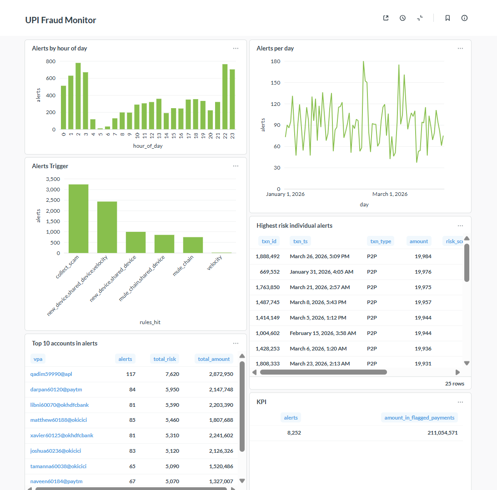
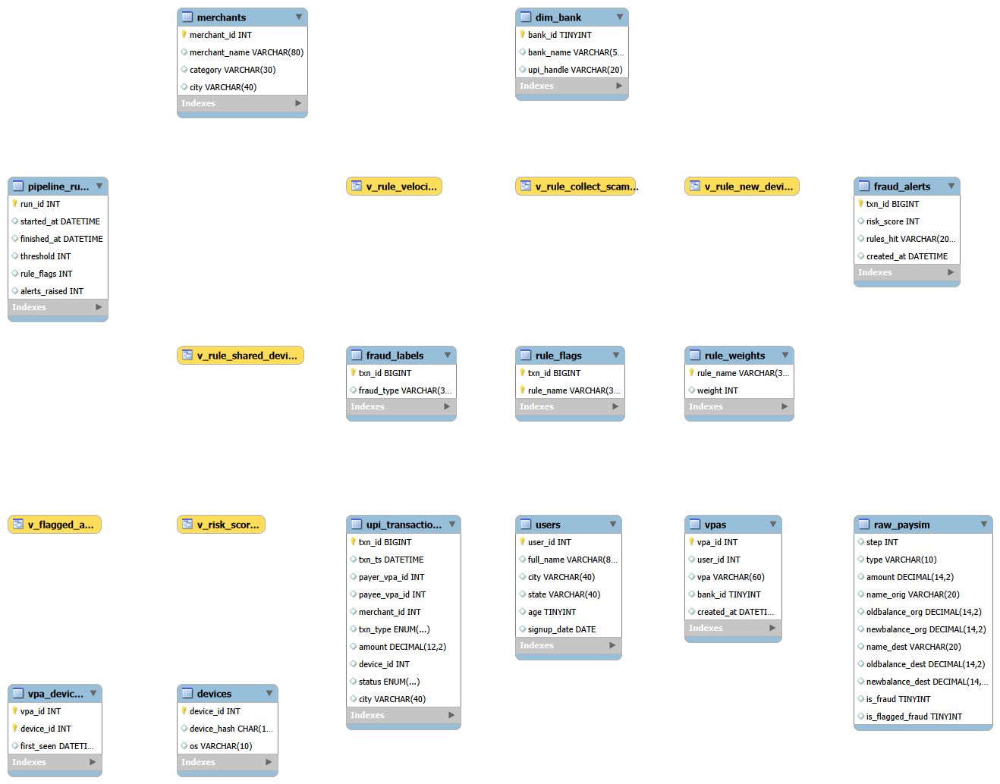

# UPI Fraud & Risk Analytics Engine (MySQL)

A fraud-detection pipeline for India-style UPI payments, written almost entirely in SQL.
It loads and profiles real-log-derived data, generates a calibrated UPI simulation with
planted fraud, detects fraud with five SQL rules (window functions, a recursive CTE,
device-graph logic), combines them into a weighted risk score, tunes performance with
indexes, automates the whole run in a stored procedure, and reports through a dashboard.

> **All transaction data in this project is synthetic.** See [Limitations](#limitations-read-this).



## Headline results

| | |
|---|---|
| Simulated transactions | 2,008,179 over 90 days (8,179 fraud, 0.41%) |
| Risk score at threshold 40 | **99.1% precision, 100% recall** (on planted fraud) |
| Fastest rule speedup from indexing | collect-scam rule 2.3s to 0.05s (~48x) |
| Full pipeline refresh | ~18s end to end, run by a stored procedure |
| Built-in baseline flag in PaySim | caught 16 of 8,213 fraud cases (~0.2%) |

## Stack
MySQL 8.0 (window functions, recursive CTEs, views, stored procedures, events) ·
Python (pandas, numpy, Faker) for data generation · Metabase for the dashboard · Git

## How it works

### 1. Profiling real-log-derived data (PaySim)
Loaded PaySim (6,362,620 mobile-money transactions) and profiled it first.
- Fraud occurs only in `TRANSFER` (4,097) and `CASH_OUT` (4,116).
- About 98% of fraud (8,034 of 8,213) empties the sender's whole balance; no normal transaction does.
- The dataset's own flag catches only 16 of 8,213 fraud cases.
- Accounts are almost all unique (6.35M senders), and only 1 fraudulent transfer was followed
  by a cash-out from the receiver. So PaySim cannot support velocity or fund-flow detection.

That finding is why the project builds its own simulator (next step).

### 2. India-style UPI simulation
`generate_upi_data.py` builds 50,300 users, 60,247 VPAs (`name@oksbi`-style), 50,111 devices,
4,000 merchants and 2,008,179 transactions, then plants three known fraud patterns:

| Pattern | Count | Idea |
|---|---|---|
| `VELOCITY_BURST` | 3,419 | a hijacked account fires many payments in minutes from an unfamiliar device |
| `MULE_CHAIN` | 1,602 | money hops victim, mule, mule, mule within minutes, each hop keeping a small cut |
| `COLLECT_SCAM` | 3,158 | a scammer pulls money from many strangers, mostly at night |

Mule accounts share a small set of "farm" devices. Fraud labels live in a separate
`fraud_labels` table that detection rules never read; it is used only to score them.

#### Data model


| Table | Key columns | Relates to |
|---|---|---|
| `users` | `user_id` | one user has one or two VPAs |
| `vpas` | `vpa_id`, `user_id`, `bank_id` | `users`, `dim_bank` |
| `dim_bank` | `bank_id` | UPI handle and bank per VPA |
| `devices` | `device_id` | linked to VPAs through `vpa_devices` |
| `vpa_devices` | (`vpa_id`, `device_id`) | registered devices per VPA |
| `merchants` | `merchant_id` | referenced by merchant (P2M) payments |
| `upi_transactions` | `txn_id` | `payer_vpa_id` / `payee_vpa_id` to `vpas`, plus `merchant_id`, `device_id` |
| `fraud_labels` | `txn_id` | answer key, used only for scoring |
| `rule_flags`, `rule_weights`, `fraud_alerts`, `pipeline_runs` | | pipeline output tables built in later steps |

Foreign keys are not declared in the database: the tables are bulk-loaded with only primary
keys for load speed, and the relationships above are enforced by the generator.

### 3. Detection rules (`04_analytics/`)

| Rule | Technique | Flagged | Caught | Precision | Recall |
|---|---|---|---|---|---|
| velocity (6+ payments in 10 min) | window function, `RANGE` interval frame | 2,424 | 2,422 | 99.9% | 29.6% |
| new_device (unregistered device) | anti-join | 3,419 | 3,419 | 100% | 41.8% |
| shared_device (device used by 5+ payers) | grouped distinct count | 7,887 | 4,273 | 54.2% | 52.2% |
| collect_scam (payee pulled from 6+ people) | aggregate profile | 3,229 | 3,158 | 97.8% | 38.6% |
| mule_chain (rapid pass-through, 3+ hops) | **recursive CTE** | 1,602 | 1,602 | 100% | 19.6% |
| **All rules (any flag)** | | 11,866 | 8,179 | 68.9% | 100% |

### 4. Weighted risk score
Treating every rule as an alarm gives 68.9% precision, mostly because the shared-device
rule also flags ordinary payments made by mule accounts. Instead each rule gets a weight
(shared_device 20, velocity 40, new_device 50, collect_scam 60, mule_chain 70) and a payment
is alerted when its summed score passes a threshold:

| Threshold | Flagged | Caught | Precision | Recall |
|---|---|---|---|---|
| 20 | 11,866 | 8,179 | 68.9% | 100% |
| **40** | **8,252** | **8,179** | **99.1%** | **100%** |
| 60 | 8,250 | 8,179 | 99.1% | 100% |
| 80 | 3,276 | 3,276 | 100% | 40.1% |

Raising the threshold trades missed fraud for fewer false alerts, the core tension in fraud operations.

### 5. Performance tuning
Added three indexes: `(payer_vpa_id, txn_ts)`, `(device_id, payer_vpa_id)`,
`(txn_type, payee_vpa_id, payer_vpa_id)`. Timings on a laptop, 2M-row table:

| Rule | Before | After |
|---|---|---|
| velocity | 18.5s | 9.6s |
| new_device | 3.9s | 1.0s |
| shared_device | 3.9s | 0.19s |
| collect_scam | 2.3s | 0.05s |
| mule_chain | 7.7s | ~4.0s |

- `EXPLAIN ANALYZE` showed the shared-device query answered entirely from the covering index.
- The velocity rule improves only modestly: the window function still processes every row.
- The first `mule_chain` run right after the index builds took 57s (cold buffer pool);
  warm reruns took about 4s. These are single runs on one machine, not rigorous benchmarks.

### 6. Automation
`sp_refresh_fraud_alerts(threshold)` truncates and rebuilds rule flags, rebuilds the
`fraud_alerts` table from the risk score, and writes a row to `pipeline_runs`.
A MySQL `EVENT` schedules it nightly. One full run: 18,561 rule flags, 8,252 alerts, ~18s.
(The simulated data does not change, so the nightly job demonstrates the automation but
produces the same alerts each time.)

### 7. Dashboard
Metabase dashboard with: alerts and amount in flagged payments, alerts per day, alerts by hour of
day (concentrated at night), which rule combinations trigger alerts, a top-10 receiving-accounts
watchlist, and the highest-risk individual alerts. Queries are in `07_dashboard/`.

## Repository layout
```
generate_upi_data.py     synthetic data generator (writes CSVs + loader script)
01_raw/                  PaySim table + load
02_cleaning/             profiling queries
03_model/                UPI schema + loader
04_analytics/            detection rules, rule_flags, risk score
06_automation/           stored procedure + nightly event
07_dashboard/            Metabase queries
docs/                    findings, performance notes, screenshots
```

## Run it yourself
1. Install MySQL Server 8.0+, Python 3.10+, and `pip install pandas numpy faker`.
2. Run `01_raw/01_create_raw.sql`, then `03_model/01_upi_schema.sql`.
3. `python generate_upi_data.py`, then run the generated `03_model/02_load_upi.sql`
   (needs `local_infile` enabled on server and client).
4. Run the files in `04_analytics/` in order, then `06_automation/01_refresh_procedure.sql`
   and `CALL sp_refresh_fraud_alerts(40);`.

## Limitations (read this)
- **Synthetic data.** Real transaction-level UPI fraud data is not public. PaySim is
  simulated from real mobile-money logs; the UPI dataset is my own simulation, calibrated by hand.
- **Circular evaluation.** I planted the fraud patterns and then wrote rules for them, so
  100% recall shows the pipeline works as designed. It is not a claim about real-world accuracy.
- **Hand-tuned weights.** Risk weights were chosen after seeing results on the same data.
  A proper evaluation would tune on one period and test on a later one.
- **Simulation artifacts.** In the simulation normal users never change phones, which makes
  the new-device rule look near-perfect. Real users do change phones.
- **Velocity rule is not real-time.** It fires on the 6th payment in a window, so the first
  five payments of a burst are missed by that rule alone (the device rule covers them here).
- `COLLECT` is modeled as a generic pull-request pattern; the simulator does not track
  current NPCI collect-request policy.

## Next steps
Time-based train/test split for weights, noisy and evasive fraud the rules were not designed
for, date partitioning of the transactions table, and a cloud-warehouse port of the schema.
